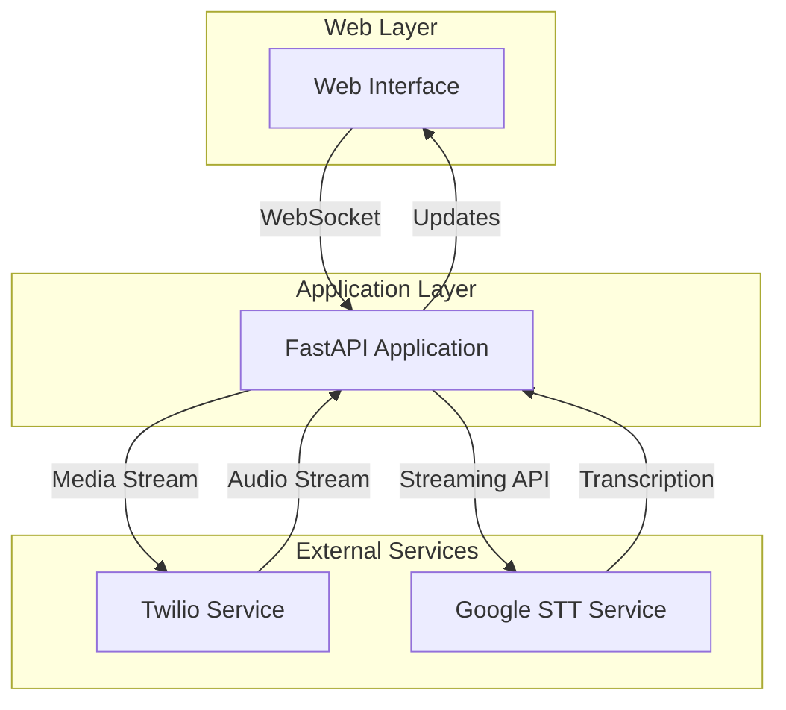
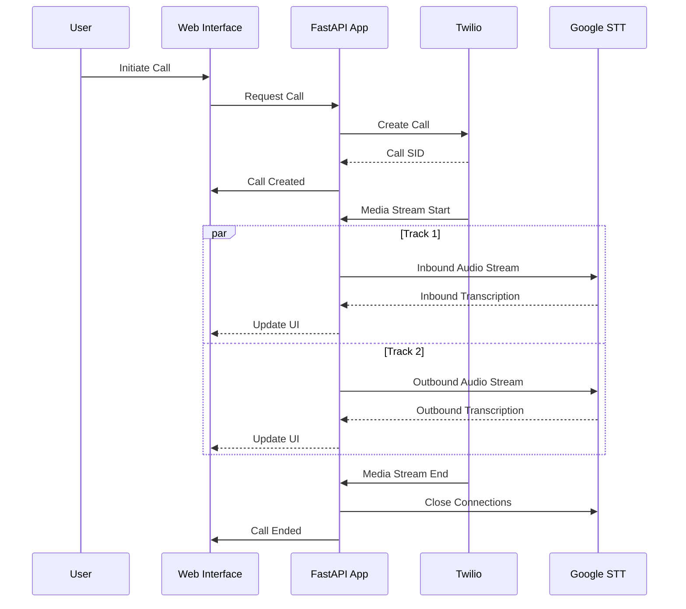
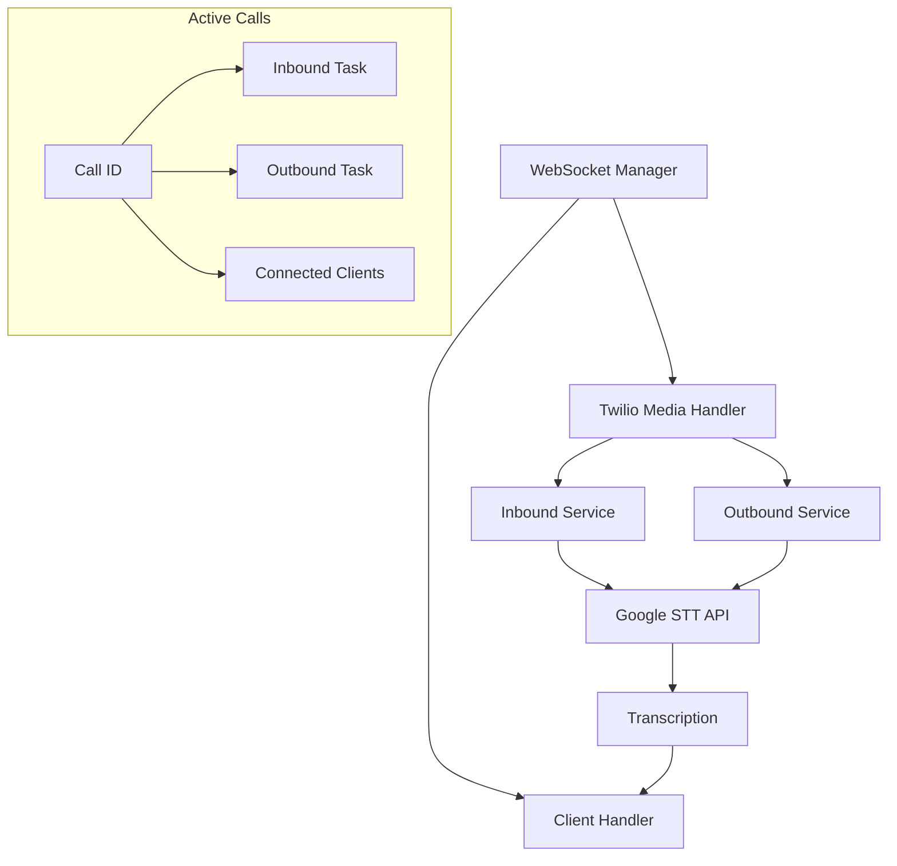
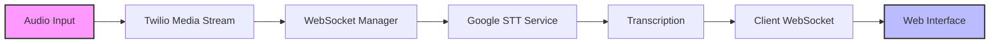

# System Architecture

## High-Level Overview

## Call Flow

## WebSocket Management

## Component Details

### WebSocket Manager
- Manages active call sessions
- Handles WebSocket connections from both Twilio and web clients
- Routes audio streams and transcriptions
- Maintains client subscriptions

### Google STT Service
- Handles real-time audio transcription
- Maintains streaming connection to Google Speech-to-Text API
- Processes both inbound and outbound audio tracks
- Uses queues for efficient audio chunk processing

### Twilio Service
- Initiates outbound calls
- Configures media streams
- Manages call routing
- Handles TwiML generation

## Data Flow

## Architecture Decisions

1. **WebSocket-based Communication**
   - Real-time audio streaming
   - Bi-directional communication
   - Low latency updates

2. **Service Separation**
   - Modular design
   - Independent scaling
   - Clear responsibility boundaries

3. **Async Processing**
   - Non-blocking operations
   - Efficient resource usage
   - Better scalability

4. **Track Separation**
   - Independent inbound/outbound processing
   - Isolated failure domains
   - Better monitoring capability
